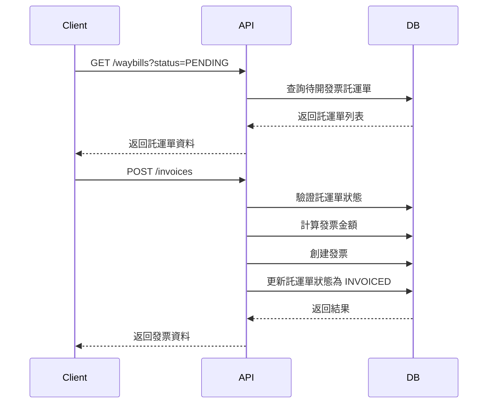

# 皓揚財務追蹤系統 API 文件

## 概述

皓揚財務追蹤系統提供完整的 RESTful API，用於管理託運單、發票、公司和司機資料。

### 基本資訊
- **Base URL**: `https://api.haoyang-finance.com/api/v1`
- **認證方式**: JWT Token (未來實現)
- **資料格式**: JSON
- **字元編碼**: UTF-8

## 快速開始

### 1. 建立公司
```bash
curl -X POST https://api.haoyang-finance.com/api/v1/companies \
  -H "Content-Type: application/json" \
  -d '{
    "name": "測試公司",
    "taxId": "12345678",
    "contactPerson": "張三",
    "phone": "02-12345678"
  }'
```

### 2. 建立司機
```bash
curl -X POST https://api.haoyang-finance.com/api/v1/drivers \
  -H "Content-Type: application/json" \
  -d '{
    "name": "司機甲",
    "phone": "0912345678"
  }'
```

### 3. 建立託運單
```bash
curl -X POST https://api.haoyang-finance.com/api/v1/waybills \
  -H "Content-Type: application/json" \
  -d '{
    "waybillNumber": "WB240001",
    "date": "2024-01-01",
    "item": "建材運送",
    "companyId": "company-uuid",
    "driverId": "driver-uuid",
    "fee": 5000.00
  }'
```

### 4. 開立發票
```bash
curl -X POST https://api.haoyang-finance.com/api/v1/invoices \
  -H "Content-Type: application/json" \
  -d '{
    "invoiceNumber": "AB12345678",
    "date": "2024-01-01",
    "companyId": "company-uuid",
    "waybillIds": ["waybill-uuid"]
  }'
```

## API 端點總覽

### 公司管理
| 方法 | 端點 | 描述 |
|------|------|------|
| GET | `/companies` | 取得公司列表 |
| POST | `/companies` | 新增公司 |
| GET | `/companies/{id}` | 取得單一公司 |
| PUT | `/companies/{id}` | 更新公司 |
| DELETE | `/companies/{id}` | 刪除公司 |

### 司機管理
| 方法 | 端點 | 描述 |
|------|------|------|
| GET | `/drivers` | 取得司機列表 |
| POST | `/drivers` | 新增司機 |
| GET | `/drivers/{id}` | 取得單一司機 |
| PUT | `/drivers/{id}` | 更新司機 |
| DELETE | `/drivers/{id}` | 刪除司機 |

### 託運單管理
| 方法 | 端點 | 描述 |
|------|------|------|
| GET | `/waybills` | 取得託運單列表 |
| POST | `/waybills` | 新增託運單 |
| GET | `/waybills/{id}` | 取得單一託運單 |
| PUT | `/waybills/{id}` | 更新託運單 |
| DELETE | `/waybills/{id}` | 刪除託運單 |
| PUT | `/waybills/{id}/no-invoice` | 標記為不需開發票 |
| PUT | `/waybills/{id}/restore` | 還原為待開發票 |

### 發票管理
| 方法 | 端點 | 描述 |
|------|------|------|
| GET | `/invoices` | 取得發票列表 |
| POST | `/invoices` | 新增發票 |
| GET | `/invoices/{id}` | 取得單一發票 |
| PUT | `/invoices/{id}` | 更新發票 |
| DELETE | `/invoices/{id}` | 刪除發票 |
| POST | `/invoices/{id}/void` | 作廢發票 |
| POST | `/invoices/{id}/mark-paid` | 標記已收款 |

## 核心業務流程

### 開立發票流程
1. 查詢待開發票的託運單
2. 選擇同一公司的託運單
3. 選擇要包含的額外費用
4. 提交發票資料
5. 系統自動計算金額並更新託運單狀態



## 分頁和排序

### 分頁參數
```
GET /api/v1/waybills?page=1&limit=50
```

### 排序參數
```
GET /api/v1/waybills?sort=date&order=desc
```

### 篩選參數
```
GET /api/v1/waybills?status=PENDING&company_id=uuid&date_from=2024-01-01
```

## 錯誤處理

### 錯誤回應格式
```json
{
  "success": false,
  "error": {
    "code": "VALIDATION_ERROR",
    "message": "資料驗證失敗",
    "details": [
      {
        "field": "name",
        "code": "REQUIRED",
        "message": "公司名稱為必填欄位"
      }
    ]
  },
  "meta": {
    "timestamp": "2024-01-01T10:00:00Z",
    "requestId": "req_123456789"
  }
}
```

### 常見錯誤代碼
- `VALIDATION_ERROR`: 資料驗證失敗
- `RESOURCE_NOT_FOUND`: 資源不存在
- `INVOICE_NUMBER_DUPLICATE`: 發票編號重複
- `WAYBILL_NOT_EDITABLE`: 託運單不可編輯
- `WAYBILL_ALREADY_INVOICED`: 託運單已開發票

## 資料模型

### 公司 (Company)
```json
{
  "id": "uuid",
  "name": "string",
  "taxId": "string",
  "contactPerson": "string",
  "phone": "string",
  "address": "string",
  "email": "string",
  "isActive": "boolean",
  "createdAt": "datetime",
  "updatedAt": "datetime"
}
```

### 司機 (Driver)
```json
{
  "id": "uuid",
  "name": "string",
  "phone": "string",
  "isActive": "boolean",
  "createdAt": "datetime",
  "updatedAt": "datetime"
}
```

### 託運單 (Waybill)
```json
{
  "id": "uuid",
  "waybillNumber": "string",
  "date": "date",
  "item": "string",
  "companyId": "uuid",
  "companyName": "string",
  "loadingLocations": [
    {
      "from": "string",
      "to": "string"
    }
  ],
  "workingTime": {
    "start": "time",
    "end": "time"
  },
  "fee": "decimal",
  "driverId": "uuid",
  "driverName": "string",
  "plateNumber": "string",
  "notes": "string",
  "extraExpenses": [
    {
      "item": "string",
      "fee": "decimal",
      "notes": "string"
    }
  ],
  "status": "PENDING|INVOICED|NO_INVOICE_NEEDED",
  "invoiceId": "uuid",
  "createdAt": "datetime",
  "updatedAt": "datetime"
}
```

### 發票 (Invoice)
```json
{
  "id": "uuid",
  "invoiceNumber": "string",
  "date": "date",
  "companyId": "uuid",
  "companyName": "string",
  "subtotal": "decimal",
  "taxRate": "decimal",
  "extraExpensesIncludeTax": "boolean",
  "tax": "decimal",
  "total": "decimal",
  "status": "issued|paid|void",
  "paymentMethod": "string",
  "paymentNote": "string",
  "notes": "string",
  "createdAt": "datetime",
  "updatedAt": "datetime",
  "paidAt": "datetime",
  "waybills": [
    {
      "id": "uuid",
      "waybillNumber": "string",
      "fee": "decimal"
    }
  ]
}
```

## 業務規則

### 託運單狀態轉換
- `PENDING` → `INVOICED`: 開立發票時
- `PENDING` → `NO_INVOICE_NEEDED`: 標記不需開發票時
- `INVOICED` → `PENDING`: 發票刪除或作廢時
- `NO_INVOICE_NEEDED` → `PENDING`: 還原時

### 發票金額計算
1. **小計** = 託運單金額總和 + 選定額外費用總和
2. **稅額**:
   - 若 `extraExpensesIncludeTax` = true: 稅額 = 小計 × 稅率
   - 若 `extraExpensesIncludeTax` = false: 稅額 = 託運單金額總和 × 稅率
3. **總計** = 小計 + 稅額

## 測試範例

### 使用 JavaScript/Axios
```javascript
import axios from 'axios';

const api = axios.create({
  baseURL: 'https://api.haoyang-finance.com/api/v1',
  headers: {
    'Content-Type': 'application/json'
  }
});

// 創建公司
const createCompany = async (companyData) => {
  try {
    const response = await api.post('/companies', companyData);
    return response.data;
  } catch (error) {
    console.error('Error creating company:', error.response.data);
    throw error;
  }
};

// 查詢待開發票託運單
const getPendingWaybills = async () => {
  try {
    const response = await api.get('/waybills', {
      params: { status: 'PENDING' }
    });
    return response.data;
  } catch (error) {
    console.error('Error fetching waybills:', error.response.data);
    throw error;
  }
};

// 開立發票
const createInvoice = async (invoiceData) => {
  try {
    const response = await api.post('/invoices', invoiceData);
    return response.data;
  } catch (error) {
    console.error('Error creating invoice:', error.response.data);
    throw error;
  }
};
```

### 使用 C#/.NET
```csharp
using System.Net.Http;
using System.Text;
using System.Text.Json;

public class HaoYangFinanceApi
{
    private readonly HttpClient _httpClient;
    private readonly string _baseUrl = "https://api.haoyang-finance.com/api/v1";

    public HaoYangFinanceApi()
    {
        _httpClient = new HttpClient();
    }

    public async Task<CompanyResponse> CreateCompanyAsync(CreateCompanyRequest request)
    {
        var json = JsonSerializer.Serialize(request);
        var content = new StringContent(json, Encoding.UTF8, "application/json");
        
        var response = await _httpClient.PostAsync($"{_baseUrl}/companies", content);
        
        if (response.IsSuccessStatusCode)
        {
            var responseJson = await response.Content.ReadAsStringAsync();
            return JsonSerializer.Deserialize<CompanyResponse>(responseJson);
        }
        
        var errorJson = await response.Content.ReadAsStringAsync();
        var error = JsonSerializer.Deserialize<ErrorResponse>(errorJson);
        throw new ApiException(error.Error.Code, error.Error.Message);
    }

    public async Task<WaybillListResponse> GetPendingWaybillsAsync()
    {
        var response = await _httpClient.GetAsync($"{_baseUrl}/waybills?status=PENDING");
        
        if (response.IsSuccessStatusCode)
        {
            var responseJson = await response.Content.ReadAsStringAsync();
            return JsonSerializer.Deserialize<WaybillListResponse>(responseJson);
        }
        
        throw new ApiException("FETCH_ERROR", "Failed to fetch waybills");
    }
}
```

## 最佳實踐

### 1. 錯誤處理
- 總是檢查 `success` 欄位
- 根據 `error.code` 進行不同的錯誤處理
- 顯示使用者友善的錯誤訊息

### 2. 資料驗證
- 在前端進行基本驗證
- 後端會進行完整驗證
- 處理驗證錯誤並顯示給使用者

### 3. 效能優化
- 使用分頁減少資料傳輸
- 利用快取機制
- 避免不必要的 API 調用

### 4. 安全考量
- 驗證所有輸入資料
- 使用 HTTPS 連線
- 實作適當的認證機制

## 版本更新日誌

### v1.0.0 (2024-01-01)
- 初始版本發布
- 支援公司、司機、託運單、發票基本 CRUD 操作
- 實作託運單狀態管理
- 實作發票開立和金額計算

### 未來規劃
- 使用者認證與授權
- 報表功能
- 檔案上傳功能
- 推送通知
- 行動裝置支援