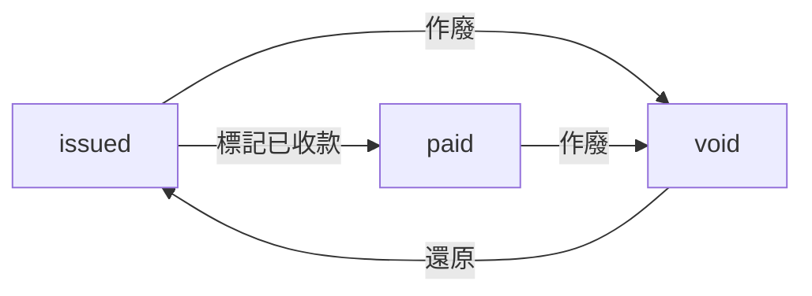

# 發票管理功能說明

## 功能概述

發票管理系統提供完整的發票生命週期管理，包括新增、編輯、刪除、作廢、付款追蹤等功能。系統與託運單管理緊密整合，確保資料一致性和業務流程的完整性。

---

## 一、發票狀態管理

### 狀態定義

發票採用字串類型進行狀態管理，共有三種狀態：

| 狀態值   | 中文說明 | 說明                                       |
| -------- | -------- | ------------------------------------------ |
| `issued` | 已開立   | 發票已開立，尚未收款，可作廢、刪除         |
| `paid`   | 已收款   | 發票已收款，可作廢、刪除                   |
| `void`   | 已作廢   | 發票已作廢，僅可刪除，付款資料保留以供審計 |

### 狀態轉換規則



#### 詳細轉換說明

1. **issued → paid**

   - 觸發時機：使用者標記發票已收款
   - API 端點：`POST /api/invoice/{id}/mark-paid`
   - 權限要求：`InvoiceMarkPaid`
   - 必填資訊：付款方式、付款時間
   - 可選資訊：付款備註

2. **issued → void** / **paid → void**

   - 觸發時機：使用者作廢發票
   - API 端點：`POST /api/invoice/{id}/void`
   - 權限要求：`InvoiceVoid`
   - 關聯操作：所有關聯託運單還原為 `PENDING`
   - 資料保留：付款資料保留（若已收款）

3. **void → issued**
   - 觸發時機：使用者還原發票
   - API 端點：`POST /api/invoice/{id}/restore`
   - 權限要求：`InvoiceUpdate`
   - 關聯操作：所有關聯託運單恢復為 `INVOICED`
   - 資料處理：清除付款資料（付款方式、備註、時間）

### 狀態操作權限

| 狀態     | 可編輯 | 可刪除 | 可作廢 | 可標記已收款 | 可還原 |
| -------- | ------ | ------ | ------ | ------------ | ------ |
| `issued` | ✅     | ✅     | ✅     | ✅           | ❌     |
| `paid`   | ✅     | ✅     | ✅     | ❌           | ❌     |
| `void`   | ❌     | ✅     | ❌     | ❌           | ✅     |

---

## 二、發票資料管理

### 表單欄位定義

| 欄位名稱                | 資料類型      | 必填 | 前端驗證                     | 後端驗證             | 說明                          |
| ----------------------- | ------------- | ---- | ---------------------------- | -------------------- | ----------------------------- |
| id                      | UUID          | 是   | 自動產生                     | UUID 格式            | 主鍵                          |
| invoiceNumber           | string        | 是   | 必填，唯一性檢查             | 唯一性檢查           | 發票號碼                      |
| date                    | date (string) | 是   | 日期格式                     | 日期格式             | 發票開立日期                  |
| companyId               | UUID          | 是   | 必須選擇                     | 驗證公司存在         | 公司 ID                       |
| companyName             | string        | 是   | 唯讀                         | -                    | 公司名稱（冗餘，開立時快照）  |
| subtotal                | decimal       | 是   | 自動計算                     | 後端計算             | 小計                          |
| taxRate                 | decimal       | 是   | 數值，0-1 之間，預設 0.05    | 數值                 | 稅率                          |
| extraExpensesIncludeTax | boolean       | 是   | 預設 false                   | -                    | 額外費用是否包含稅率          |
| tax                     | decimal       | 是   | 自動計算                     | 後端計算             | 稅額                          |
| total                   | decimal       | 是   | 自動計算                     | 後端計算             | 總計                          |
| status                  | enum (string) | 是   | 預設 issued                  | 預設 issued          | 發票狀態                      |
| paymentMethod           | string        | 否   | 標記已收款時必填             | 標記已收款時驗證     | 付款方式（現金/轉帳/票據）    |
| paymentNote             | string        | 否   | -                            | -                    | 付款備註                      |
| paidAt                  | datetime      | 否   | 標記已收款時自動填入當前時間 | 標記已收款時自動記錄 | 收款時間（ISO 8601 字串格式） |
| notes                   | string        | 否   | -                            | -                    | 發票備註                      |
| waybills                | array         | 是   | 至少一筆，同一公司           | 至少一筆，同一公司   | 關聯的託運單列表              |
| selectedExtraExpenseIds | array         | 否   | -                            | 驗證屬於選定的託運單 | 選定的額外費用 IDs            |
| createdAt               | datetime      | 是   | 自動產生                     | 自動產生             | 建立時間                      |
| updatedAt               | datetime      | 是   | 自動更新                     | 自動更新             | 更新時間                      |

#### 金額計算邏輯

```typescript
// 計算邏輯（前後端一致）
const waybillAmount = waybills.reduce((sum, w) => sum + w.fee, 0);
const selectedExtraExpenseAmount = selectedExtraExpenses.reduce(
  (sum, e) => sum + e.fee,
  0
);

let subtotal, tax, total;

if (extraExpensesIncludeTax) {
  // 額外費用包含稅率
  subtotal = waybillAmount + selectedExtraExpenseAmount;
  tax = subtotal * taxRate;
  total = subtotal + tax;
} else {
  // 額外費用不包含稅率
  subtotal = waybillAmount + selectedExtraExpenseAmount;
  tax = waybillAmount * taxRate; // 僅託運單金額計稅
  total = subtotal + tax;
}
```

### CRUD 操作

#### 1. 新增發票

- **API 端點**: `POST /api/invoice`
- **權限要求**: `InvoiceCreate`
- **請求 Body**: `CreateInvoiceDto`
- **前置驗證**:
  - 發票號碼唯一性檢查
  - 所有託運單屬於同一公司
  - 所有託運單狀態為 `PENDING`
  - 額外費用屬於選定的託運單
- **自動處理**:
  - 計算 `subtotal`、`tax`、`total`
  - 建立 `invoice_waybill` 關聯記錄
  - 建立 `invoice_extra_expense` 關聯記錄（若有選定額外費用）
  - 更新關聯託運單狀態為 `INVOICED`
  - 設定託運單的 `invoiceId`
- **交易保證**: 所有操作在同一資料庫交易中完成
- **回傳**: `InvoiceDto`

#### 2. 更新發票

- **API 端點**: `PUT /api/invoice/{id}`
- **權限要求**: `InvoiceUpdate`
- **請求 Body**: `UpdateInvoiceDto`
- **可更新範圍**:
  - 發票號碼（需檢查唯一性）
  - 日期
  - 稅率
  - 額外費用是否包含稅率
  - 備註
  - **關聯的託運單**（可異動選取哪些託運單）
  - **選定的額外費用**
- **前置驗證**:
  - 新的發票號碼唯一性（如有異動）
  - 新選定的託運單狀態為 `PENDING` 或已關聯此發票（`INVOICED` 且 `invoiceId == id`）
  - 額外費用屬於選定的託運單
- **自動處理**:
  - 移除舊的 `invoice_waybill` 和 `invoice_extra_expense` 關聯
  - 還原舊託運單狀態為 `PENDING`，清除 `invoiceId`
  - 建立新的關聯記錄
  - 更新新託運單狀態為 `INVOICED`，設定 `invoiceId`
  - 重新計算金額
- **交易保證**: 所有操作在同一資料庫交易中完成
- **回傳**: 204 No Content

#### 3. 刪除發票（物理刪除）

- **API 端點**: `DELETE /api/invoice/{id}`
- **權限要求**: `InvoiceDelete`
- **前置驗證**: 發票狀態為 `issued` 或 `void`
- **自動處理**:
  - 還原所有關聯託運單狀態為 `PENDING`
  - 清除託運單的 `invoiceId`
  - 刪除 `invoice_waybill` 關聯記錄
  - 刪除 `invoice_extra_expense` 關聯記錄
  - 刪除發票主記錄
- **交易保證**: 所有操作在同一資料庫交易中完成
- **回傳**: 204 No Content

#### 4. 作廢發票（邏輯刪除）

- **API 端點**: `POST /api/invoice/{id}/void`
- **權限要求**: `InvoiceVoid`
- **前置驗證**: 發票狀態為 `issued` 或 `paid`
- **自動處理**:
  - 還原所有關聯託運單狀態為 `PENDING`
  - 清除託運單的 `invoiceId`
  - 發票狀態 → `void`
  - **保留付款資料**（`paymentMethod`、`paymentNote`、`paidAt`）
- **資料保留原因**: 審計追蹤，記錄已收款但作廢的發票
- **交易保證**: 所有操作在同一資料庫交易中完成
- **回傳**: `{ message: "發票已成功作廢" }`

#### 5. 標記已收款

- **API 端點**: `POST /api/invoice/{id}/mark-paid`
- **權限要求**: `InvoiceMarkPaid`
- **請求 Body**: `MarkInvoicePaidDto`
  ```json
  {
    "paymentMethod": "現金|轉帳|票據", // 必填
    "paymentNote": "付款備註（可選）",
    "paidAt": "2024-01-01T10:00:00Z" // 可選，預設當前時間
  }
  ```
- **前置驗證**:
  - 發票狀態必須為 `issued`
  - 付款方式必須為有效選項（現金、轉帳、票據）
- **自動處理**:
  - 發票狀態 → `paid`
  - 記錄 `paymentMethod`、`paymentNote`、`paidAt`
  - 更新 `updatedAt`
- **回傳**: `{ message: "發票已成功標記為已收款" }`

#### 6. 還原發票

- **API 端點**: `POST /api/invoice/{id}/restore`
- **權限要求**: `InvoiceUpdate`
- **前置驗證**: 發票狀態必須為 `void`
- **自動處理**:
  - 發票狀態 → `issued`
  - 清除付款資料（`paymentMethod`、`paymentNote`、`paidAt`）
  - 恢復所有關聯託運單狀態為 `INVOICED`
  - 設定託運單的 `invoiceId`
- **交易保證**: 所有操作在同一資料庫交易中完成
- **回傳**: `{ message: "發票已成功恢復" }`

#### 7. 查詢發票

##### 7.1 查詢發票列表

- **API 端點**: `GET /api/invoice`
- **權限要求**: `InvoiceRead`
- **查詢參數**:
  - `startDate`: 開始日期（可選）
  - `endDate`: 結束日期（可選）
  - `status`: 發票狀態篩選（issued/paid/void，可選）
  - `companyId`: 公司 ID 篩選（可選）
- **回傳**: `InvoiceDto[]`（包含關聯的 waybills 和 extraExpenses）

##### 7.2 根據 ID 查詢單個發票

- **API 端點**: `GET /api/invoice/{id}`
- **權限要求**: `InvoiceRead`
- **回傳**: `InvoiceDto`（包含關聯的 waybills 和 extraExpenses）

##### 7.3 發票統計

- **API 端點**: `GET /api/invoice/stats`
- **權限要求**: `StatisticsRead`
- **查詢參數**:
  - `startDate`: 開始日期（可選）
  - `endDate`: 結束日期（可選）
- **回傳**: `InvoiceStatsDto`
  ```typescript
  interface InvoiceStatsDto {
    totalInvoices: number; // 總發票數
    paidInvoices: number; // 已收款發票數
    unpaidInvoices: number; // 未收款發票數（issued）
    voidInvoices: number; // 已作廢發票數
    totalAmount: decimal; // 總金額（不含作廢）
    paidAmount: decimal; // 已收款金額
    unpaidAmount: decimal; // 未收款金額
  }
  ```

---

## 三、前端設計與實現

### 技術棧

- **框架**: React 18 + TypeScript
- **UI 組件**: Material-UI (MUI)
- **狀態管理**:
  - Recoil (客戶端狀態)
  - TanStack Query (伺服器狀態)
- **表單管理**: React Hook Form
- **資料表格**: AG Grid (支援虛擬滾動)
- **日期處理**: date-fns
- **建構工具**: Vite

### 主要功能組件

#### 1. FinancePage 主頁面

- **路徑**: `src/features/Finance/components/FinancePage/FinancePage.tsx`
- **功能**:
  - 月份選擇器
  - 司機快速篩選按鈕
  - Tab 切換（未開立發票、待收款、不需開發票、已開立發票）
  - 整合託運單列表和發票列表

#### 2. InvoiceDialog 發票表單對話框

- **路徑**: `src/features/Finance/components/InvoiceDialog/InvoiceDialog.tsx`
- **功能**:
  - 新增/編輯發票表單
  - 託運單選擇（多選）
  - 額外費用選擇（勾選框）
  - 稅率設定
  - 額外費用是否包含稅率勾選
  - 即時金額計算（subtotal、tax、total）
  - 發票號碼唯一性驗證

#### 3. InvoicedTable 已開立發票列表

- **路徑**: `src/features/Finance/components/InvoicedTable/InvoicedTable.tsx`
- **功能**:
  - 顯示已開立的發票清單
  - 操作按鈕（依狀態動態顯示）
  - 展開/收合顯示關聯的託運單
  - 編輯/作廢/刪除/標記已收款

#### 4. UninvoicedTable 未開立發票列表

- **路徑**: `src/features/Finance/components/UninvoicedTable/UninvoicedTable.tsx`
- **功能**:
  - 顯示 `PENDING` 狀態的託運單
  - 依公司分組顯示
  - 選取託運單開立發票

#### 5. PendingPaymentTable / NoInvoicedNeededTable

- **路徑**:
  - `src/features/Finance/components/PendingPaymentTable/PendingPaymentTable.tsx`
  - `src/features/Finance/components/NoInvoicedTable/NoInvoicedTable.tsx`
- **功能**: 顯示對應狀態的託運單列表

### 操作按鈕設計

| 發票狀態 | 可用操作按鈕                 | 說明             |
| -------- | ---------------------------- | ---------------- |
| `issued` | 編輯、標記已收款、作廢、刪除 | 所有操作皆可執行 |
| `paid`   | 編輯、作廢、刪除             | 不可再標記已收款 |
| `void`   | 還原、刪除                   | 僅可還原或刪除   |

### 標記已收款對話框設計

- **標題**: 標記發票已收款
- **內容**:
  - 發票編號（唯讀顯示）
  - 付款方式選擇（必選）: 現金、轉帳、票據
  - 付款備註（可選）: 多行文字輸入
  - 收款時間（自動填入當前時間，可調整）
- **操作按鈕**: 確認、取消

### 篩選功能設計

- **收款狀態篩選**:

  - 全部
  - 已收款（paid）
  - 未收款（issued）
  - 已作廢（void）

- **公司篩選**:

  - 下拉選單，顯示所有有發票的公司
  - 支援搜尋功能

- **日期範圍篩選**:
  - 發票開立日期區間選擇

---

## 四、資料庫設計

### Table: invoice

| 欄位名稱                   | 型別          | PK  | Not Null | Default  | 說明                                |
| -------------------------- | ------------- | --- | -------- | -------- | ----------------------------------- |
| id                         | UUID          | Y   | Y        | gen_uuid | 主鍵                                |
| invoice_number             | VARCHAR(50)   | N   | Y        | -        | 發票號碼（唯一）                    |
| date                       | VARCHAR       | N   | Y        | -        | 發票開立日期（字串格式 yyyy-MM-dd） |
| company_id                 | UUID          | N   | Y        | -        | 公司 ID（FK: company）              |
| company_name               | VARCHAR(100)  | N   | Y        | -        | 公司名稱（冗餘欄位，開立時快照）    |
| subtotal                   | DECIMAL(18,2) | N   | Y        | -        | 小計                                |
| tax_rate                   | DECIMAL(5,4)  | N   | Y        | 0.05     | 稅率                                |
| extra_expenses_include_tax | BOOLEAN       | N   | Y        | false    | 額外費用是否包含稅率                |
| tax                        | DECIMAL(18,2) | N   | Y        | -        | 稅額                                |
| total                      | DECIMAL(18,2) | N   | Y        | -        | 總計                                |
| status                     | VARCHAR(10)   | N   | Y        | -        | issued/paid/void                    |
| payment_method             | VARCHAR(20)   | N   | N        | NULL     | 付款方式（現金/轉帳/票據）          |
| payment_note               | TEXT          | N   | N        | NULL     | 付款備註                            |
| notes                      | TEXT          | N   | N        | NULL     | 發票備註                            |
| created_at                 | VARCHAR       | N   | Y        | UTC now  | 建立時間（字串格式 ISO 8601）       |
| updated_at                 | VARCHAR       | N   | Y        | UTC now  | 更新時間（字串格式 ISO 8601）       |
| paid_at                    | VARCHAR       | N   | N        | NULL     | 收款時間（字串格式 ISO 8601）       |

### Table: invoice_waybill（發票與託運單關聯表）

| 欄位名稱   | 型別 | PK  | Not Null | Default  | 說明        |
| ---------- | ---- | --- | -------- | -------- | ----------- |
| id         | UUID | Y   | Y        | gen_uuid | 主鍵        |
| invoice_id | UUID | N   | Y        | -        | FK: invoice |
| waybill_id | UUID | N   | Y        | -        | FK: waybill |

### Table: invoice_extra_expense（發票包含的額外費用）

| 欄位名稱         | 型別 | PK  | Not Null | Default  | 說明              |
| ---------------- | ---- | --- | -------- | -------- | ----------------- |
| id               | UUID | Y   | Y        | gen_uuid | 主鍵              |
| invoice_id       | UUID | N   | Y        | -        | FK: invoice       |
| extra_expense_id | UUID | N   | Y        | -        | FK: extra_expense |

---

## 五、業務規則與限制

### 1. 發票編號唯一性

- **檢查時機**: 新增/編輯時
- **檢查範圍**: 全資料庫
- **處理邏輯**: 自動去除空白，轉為大寫後檢查
- **錯誤訊息**: "發票號碼 '{invoiceNumber}' 已存在"

### 2. 託運單選擇限制

- **同一公司**: 所有選定的託運單必須屬於同一公司
- **狀態限制**:
  - 新增發票時：託運單狀態必須為 `PENDING`
  - 編輯發票時：託運單狀態必須為 `PENDING` 或已關聯此發票（`INVOICED` 且 `invoiceId == id`）
- **數量限制**: 至少選擇一筆託運單

### 3. 額外費用選擇限制

- **關聯性驗證**: 選定的額外費用必須屬於選定的託運單
- **可選性**: 額外費用為可選項，可以不選
- **多選**: 支援選擇多筆額外費用

### 4. 金額計算規則

- **計算時機**: 新增/編輯時後端自動計算
- **前端即時計算**: 表單中即時顯示計算結果
- **一致性保證**: 前後端計算邏輯完全一致
- **精度**: Decimal(18,2)

### 5. 狀態轉換限制

- **標記已收款**: 只有 `issued` 狀態可標記
- **作廢**: `issued` 和 `paid` 狀態可作廢
- **還原**: 只有 `void` 狀態可還原
- **編輯**: `issued` 和 `paid` 狀態可編輯
- **刪除**: `issued` 和 `void` 狀態可刪除

### 6. 權限控制

所有 API 需要對應權限：

- `InvoiceRead`: 查詢發票
- `InvoiceCreate`: 新增發票
- `InvoiceUpdate`: 更新發票、還原發票
- `InvoiceDelete`: 刪除發票
- `InvoiceVoid`: 作廢發票
- `InvoiceMarkPaid`: 標記已收款
- `StatisticsRead`: 查看統計資料

---

## 六、與託運單管理的整合

### 1. 狀態同步機制

發票操作會自動同步託運單狀態，所有操作在同一資料庫交易中完成：

| 發票操作 | 託運單狀態變化                          | 關聯資料操作           |
| -------- | --------------------------------------- | ---------------------- |
| 新增發票 | PENDING → INVOICED                      | 建立 invoice_waybill   |
| 編輯發票 | 舊託運單 → PENDING，新託運單 → INVOICED | 刪除舊關聯，建立新關聯 |
| 刪除發票 | INVOICED → PENDING                      | 刪除 invoice_waybill   |
| 作廢發票 | INVOICED → PENDING                      | 保留 invoice_waybill   |
| 還原發票 | PENDING → INVOICED                      | 恢復 invoice_waybill   |

### 2. 資料一致性保證

- **交易完整性**: 所有發票和託運單的狀態變更在同一資料庫交易中完成
- **原子操作**: 操作失敗時完整回滾，不會出現部分成功的情況
- **冗餘資料**: `companyName` 在發票中冗餘存儲，記錄開立時的快照
- **審計追蹤**: 作廢發票保留付款資料，支援審計需求

### 3. 額外費用處理

- **選擇性加入**: 託運單的額外費用可選擇性加入發票
- **關聯記錄**: 透過 `invoice_extra_expense` 表記錄選定的額外費用
- **稅額影響**: `extraExpensesIncludeTax` 決定額外費用是否計入稅額
- **刪除處理**: 發票刪除時，額外費用不受影響，僅刪除關聯記錄

---

## 七、錯誤處理

### 常見錯誤碼與訊息

| HTTP 狀態碼 | 錯誤情境                   | 錯誤訊息範例                           |
| ----------- | -------------------------- | -------------------------------------- |
| 400         | 發票號碼重複               | 發票號碼 'AB12345678' 已存在           |
| 400         | 託運單不屬於同一公司       | 所有託運單必須屬於同一公司             |
| 400         | 託運單狀態無效             | 託運單狀態無效                         |
| 400         | 額外費用不屬於選定的託運單 | 部分額外費用不存在或不屬於選定的託運單 |
| 400         | 狀態不符無法標記已收款     | 無法標記狀態為 'paid' 的發票為已收款   |
| 400         | 狀態不符無法作廢           | 無法作廢狀態為 'void' 的發票           |
| 400         | 狀態不符無法刪除           | 只有作廢和未收款狀態的發票可以刪除     |
| 404         | 發票不存在                 | 找不到指定的發票                       |
| 404         | 公司不存在                 | 找不到指定的公司                       |
| 404         | 託運單不存在               | 部分託運單不存在                       |

---

## 八、最佳實踐與建議

### 1. 發票號碼管理

- **格式建議**: 採用統一格式（如：年份+流水號）
- **唯一性**: 系統自動檢查唯一性，避免重複
- **自動生成**: 建議前端提供自動生成功能，減少輸入錯誤

### 2. 額外費用處理

- **預設全選**: 開立發票時預設勾選所有額外費用
- **明確標示**: 清楚標示哪些額外費用已選入發票
- **稅額計算**: 明確告知使用者勾選「額外費用包含稅率」的影響

### 3. 付款追蹤

- **及時記錄**: 收款後立即標記已收款
- **備註詳細**: 付款備註應記錄詳細資訊（如票據號碼、轉帳帳號末四碼等）
- **付款方式**: 統一使用固定選項（現金、轉帳、票據）

### 4. 作廢處理

- **審慎作廢**: 作廢操作應有明確原因
- **保留資料**: 作廢發票保留所有資料，僅變更狀態
- **可追蹤**: 作廢後仍可查詢和審計

### 5. 資料一致性

- **交易處理**: 所有涉及多表操作必須在同一交易中完成
- **狀態同步**: 發票和託運單狀態必須同步變更
- **錯誤回滾**: 操作失敗時完整回滾，確保資料一致性

---

## 九、未來優化方向

1. **批量開立發票**:

   - 依公司分組
   - 自動生成多張發票

2. **發票模板**:

   - 儲存常用設定
   - 快速套用模板

3. **匯出功能**:

   - PDF 發票
   - Excel 報表
   - 批次匯出

4. **進階統計**:

   - 收款趨勢分析
   - 公司別收款統計
   - 逾期未收款提醒

5. **電子發票整合**:
   - 串接電子發票系統
   - 自動上傳發票資料

---

> 本規格文件根據實際程式碼反向工程產生，最後更新：2025-01-11
> 如有異動，請同步更新前後端實作與本文件。
