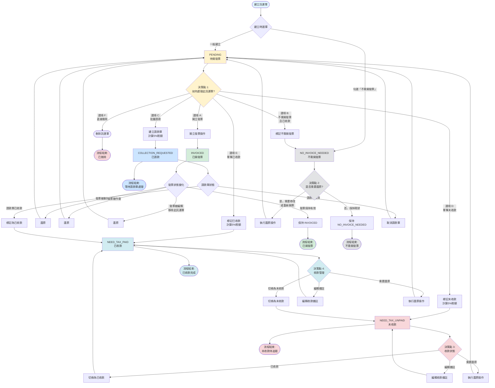

# 託運單生命週期流程圖

## 文件說明

本文件描述託運單（Waybill）從建立到最終狀態的完整生命週期，包括所有可能的決策點、狀態轉換路徑，以及與發票管理系統的整合流程。

---

## 一、生命週期概覽

託運單在系統中有 **6 種狀態**，從建立開始，根據業務需求和操作選擇，會經歷不同的狀態轉換路徑。

### 狀態定義

| 狀態                    | 說明                               | 可編輯 | 可刪除 | 稅額計算 |
| ----------------------- | ---------------------------------- | ------ | ------ | -------- |
| `PENDING`               | 待處理，等待決定是否開發票         | ✅     | ✅     | -        |
| `INVOICED`              | 已開立發票                         | ❌     | ❌     | -        |
| `NO_INVOICE_NEEDED`     | 不需開發票且已收款                 | ❌     | ❌     | -        |
| `COLLECTION_REQUESTED`  | 已加入請款單，等待收款             | ❌     | ❌     | 5%       |
| `NEED_TAX_UNPAID`       | 需繳稅但尚未收款（單筆）           | ⚠️ 註  | ❌     | 5%       |
| `NEED_TAX_PAID`         | 需繳稅且已收款                     | ⚠️ 註  | ❌     | 5%       |

**註**:
- `NEED_TAX_UNPAID` 和 `NEED_TAX_PAID` 狀態僅可編輯收款備註欄位，其他欄位不可修改。系統會自動計算 5% 稅額。
- `COLLECTION_REQUESTED` 狀態的託運單必須透過取消請款單才能還原為 `PENDING`，不能直接還原。

---

## 二、完整流程圖



---

## 三、決策點詳細說明

### 決策點 0：建立託運單時

**時機**: 新增託運單

**選擇**:

1. **一般建立** → 初始狀態為 `PENDING`

   - 適用場景：大部分託運單，後續需要開立發票
   - API: `POST /api/waybill` (不勾選 `markAsNoInvoiceNeeded`)

2. **建立時標記不需開發票** → 初始狀態為 `NO_INVOICE_NEEDED`
   - 適用場景：明確知道不需開發票且已收現金
   - API: `POST /api/waybill` (勾選 `markAsNoInvoiceNeeded`)

---

### 決策點 1：PENDING 狀態的處理選擇

**時機**: 託運單處於 `PENDING` 狀態時

**選擇**:

#### 選項 A：開立發票

- **業務場景**: 客戶需要正式發票，用於公司報帳或稅務申報
- **操作**: 在發票管理頁面選取此託運單開立發票
- **API**: `POST /api/invoice` (包含此託運單 ID)
- **狀態變化**: `PENDING` → `INVOICED`
- **後續**: 託運單與發票綁定，無法單獨編輯或刪除

#### 選項 B：標記不需開發票（已收款）

- **業務場景**:
  - 客戶以現金支付且不需要發票
  - 小額交易，不需要正式發票
  - 已確認收到款項
- **操作**: 點擊「標記不需開發票」按鈕
- **API**: `PUT /api/waybill/{id}/no-invoice`
- **狀態變化**: `PENDING` → `NO_INVOICE_NEEDED`
- **後續**: 託運單標記為已完成，無需後續處理

#### 選項 C：標記未收款（需繳稅）

- **業務場景**:
  - 客戶需繳稅但尚未付款
  - 月結客戶，先記錄應收款項
  - 需要追蹤收款但不走發票流程
- **操作**: 點擊「標記未收款」按鈕
- **API**: `PUT /api/waybill/{id}/mark-unpaid-with-tax`
- **狀態變化**: `PENDING` → `NEED_TAX_UNPAID`
- **稅額計算**: 系統自動計算 5% 稅額 (TaxAmount = Fee × 0.05)
- **可選操作**: 同時更新備註，記錄收款相關資訊
- **後續**: 可持續編輯收款備註追蹤收款進度，或切換為已收款狀態

#### 選項 D：標記已收款（需繳稅）

- **業務場景**:
  - 客戶需繳稅且已付款
  - 直接從待開發票跳到已收款
  - 不需要發票但需要記錄稅額
- **操作**: 點擊「標記已收款」按鈕
- **API**: `PUT /api/waybill/{id}/mark-paid-with-tax`
- **請求 Body**:
  ```json
  {
    "paymentNotes": "收款備註",
    "paymentDate": "2024-01-01",
    "paymentMethod": "現金"
  }
  ```
- **狀態變化**: `PENDING` → `NEED_TAX_PAID`
- **稅額計算**: 系統自動計算 5% 稅額
- **記錄資訊**: PaymentNotes、PaymentReceivedAt、PaymentMethod
- **後續**: 可編輯收款備註，或切換回未收款狀態

#### 選項 E：直接刪除

- **業務場景**:
  - 錄入錯誤，需要刪除重建
  - 業務取消，不需要此記錄
- **操作**: 點擊「刪除」按鈕並確認
- **API**: `DELETE /api/waybill/{id}`
- **狀態變化**: 託運單及關聯資料完全移除
- **限制**: 僅 `PENDING` 狀態可刪除

---

### 決策點 2：NO_INVOICE_NEEDED 狀態的處理

**時機**: 託運單處於 `NO_INVOICE_NEEDED` 狀態時

**選擇**:

#### 選項 A：保持現狀

- **業務場景**: 狀態正確，無需變更
- **操作**: 無需操作
- **結果**: 託運單保持 `NO_INVOICE_NEEDED` 狀態

#### 選項 B：還原為 PENDING

- **業務場景**:
  - 標記錯誤，實際需要開立發票
  - 客戶後續要求補開發票
  - 需要修改託運單資料
- **操作**: 點擊「還原」按鈕
- **API**: `PUT /api/waybill/{id}/restore`
- **狀態變化**: `NO_INVOICE_NEEDED` → `PENDING`
- **後續**: 恢復為可編輯狀態，可重新選擇處理方式

---

### 決策點 3：NEED_TAX_UNPAID 狀態的處理

**時機**: 託運單處於 `NEED_TAX_UNPAID` 狀態時

**選擇**:

#### 選項 A：切換為已收款

- **業務場景**: 客戶已付款，需更新收款狀態
- **操作**: 點擊「切換收款狀態」或「標記已收款」按鈕
- **API**: `PUT /api/waybill/{id}/toggle-payment-status` 或 `PUT /api/waybill/{id}/mark-paid-with-tax`
- **請求 Body**:
  ```json
  {
    "paymentNotes": "收款備註",
    "paymentDate": "2024-01-01",
    "paymentMethod": "現金/轉帳/支票"
  }
  ```
- **狀態變化**: `NEED_TAX_UNPAID` → `NEED_TAX_PAID`
- **記錄資訊**: 收款備註、收款日期、付款方式

#### 選項 B：編輯收款備註

- **業務場景**:
  - 客戶尚未付款，持續追蹤
  - 更新收款進度或備註資訊
- **操作**: 點擊「編輯收款備註」按鈕
- **API**: `PUT /api/waybill/{id}/update-payment-notes`
- **請求 Body**:
  ```json
  {
    "paymentNotes": "更新的備註內容"
  }
  ```
- **狀態變化**: 保持 `NEED_TAX_UNPAID`
- **限制**: 僅能修改 `PaymentNotes` 欄位

#### 選項 C：還原為 PENDING

- **業務場景**:
  - 客戶決定改為需要發票
  - 需要全面修改託運單資料
  - 標記錯誤需要重新處理
- **操作**: 點擊「還原」按鈕
- **API**: `PUT /api/waybill/{id}/restore`
- **狀態變化**: `NEED_TAX_UNPAID` → `PENDING`
- **清除資料**: TaxAmount、TaxRate、PaymentNotes、PaymentReceivedAt、PaymentMethod
- **後續**: 恢復完整編輯權限

---

### 決策點 4：NEED_TAX_PAID 狀態的處理

**時機**: 託運單處於 `NEED_TAX_PAID` 狀態時

**選擇**:

#### 選項 A：切換為未收款

- **業務場景**:
  - 收款記錄錯誤，客戶實際未付款
  - 付款被退回或取消
- **操作**: 點擊「切換收款狀態」按鈕
- **API**: `PUT /api/waybill/{id}/toggle-payment-status`
- **狀態變化**: `NEED_TAX_PAID` → `NEED_TAX_UNPAID`
- **清除資料**: PaymentNotes、PaymentReceivedAt、PaymentMethod (保留稅額)

#### 選項 B：編輯收款備註

- **業務場景**:
  - 更新收款相關資訊
  - 補充付款細節
- **操作**: 點擊「編輯收款備註」按鈕
- **API**: `PUT /api/waybill/{id}/update-payment-notes`
- **請求 Body**:
  ```json
  {
    "paymentNotes": "更新的備註內容"
  }
  ```
- **狀態變化**: 保持 `NEED_TAX_PAID`
- **限制**: 僅能修改 `PaymentNotes` 欄位

#### 選項 C：還原為 PENDING

- **業務場景**:
  - 整個流程需要重新開始
  - 客戶決定改為開立發票
  - 需要修改託運單基本資料
- **操作**: 點擊「還原」按鈕
- **API**: `PUT /api/waybill/{id}/restore`
- **狀態變化**: `NEED_TAX_PAID` → `PENDING`
- **清除資料**: TaxAmount、TaxRate、PaymentNotes、PaymentReceivedAt、PaymentMethod
- **後續**: 恢復完整編輯權限，可重新選擇處理方式

---

### 決策點 5：COLLECTION_REQUESTED 狀態的處理

**時機**: 託運單處於 `COLLECTION_REQUESTED` 狀態（已加入請款單）

**特性**:
- 此狀態的託運單不能直接還原
- 必須透過請款單操作來變更狀態
- 託運單會隨請款單狀態變化而自動更新

#### 選項 A：請款單標記為已收款

- **業務場景**: 客戶已支付整批請款金額
- **操作**: 在請款單管理介面標記為已收款
- **API**: `POST /api/CollectionRequest/{id}/mark-paid`
- **請求 Body**:
  ```json
  {
    "paymentReceivedAt": "2024-12-20",
    "paymentMethod": "轉帳",
    "paymentNotes": "收款備註"
  }
  ```
- **狀態變化**: `COLLECTION_REQUESTED` → `NEED_TAX_PAID`
- **批量更新**: 請款單中所有託運單同時更新

#### 選項 B：取消請款單

- **業務場景**:
  - 請款單建立錯誤
  - 需要重新組合託運單
  - 客戶要求分批請款
- **操作**: 在請款單管理介面取消請款
- **API**: `POST /api/CollectionRequest/{id}/cancel`
- **請求 Body** (可選):
  ```json
  {
    "cancelReason": "取消原因"
  }
  ```
- **狀態變化**: `COLLECTION_REQUESTED` → `PENDING`
- **批量更新**: 請款單中所有託運單還原為 `PENDING`
- **後續**: 託運單可重新進行任何操作

---

### 批量請款流程（新功能）

**目的**: 將多筆 `PENDING` 狀態的託運單批量請款，統一管理收款

#### 建立請款單

- **前提條件**:
  - 所有託運單必須是 `PENDING` 狀態
  - 所有託運單必須屬於同一公司
- **操作**: 選擇多筆託運單，建立請款單
- **API**: `POST /api/CollectionRequest`
- **請求 Body**:
  ```json
  {
    "requestDate": "2024-12-20",
    "companyId": "company-uuid",
    "waybillIds": ["waybill-id-1", "waybill-id-2", "..."],
    "notes": "請款備註"
  }
  ```
- **自動處理**:
  - 計算小計（所有託運單費用總和）
  - 計算稅額（小計 × 5%）
  - 計算總額（小計 + 稅額）
  - 產生請款單號（自動或手動指定）
- **狀態變化**: 所有託運單 `PENDING` → `COLLECTION_REQUESTED`

#### 請款單管理

- **查詢請款單列表**: `GET /api/CollectionRequest`
- **查詢請款單詳情**: `GET /api/CollectionRequest/{id}`
- **刪除請款單**: `DELETE /api/CollectionRequest/{id}` (僅限已取消狀態)

---

### 發票系統觸發的狀態變化（自動）

**時機**: 發票相關操作觸發

#### 情境 A：發票被刪除

- **觸發**: 使用者刪除發票
- **API**: `DELETE /api/invoice/{id}`
- **自動處理**: 所有關聯的託運單
- **狀態變化**: `INVOICED` → `PENDING`
- **關聯處理**: 清除託運單的 `invoiceId`

#### 情境 B：發票被作廢

- **觸發**: 使用者作廢發票
- **API**: `POST /api/invoice/{id}/void`
- **自動處理**: 所有關聯的託運單
- **狀態變化**: `INVOICED` → `PENDING`
- **關聯處理**: 清除託運單的 `invoiceId`
- **註**: 發票資料保留（狀態變為 `void`），但託運單解除綁定

#### 情境 C：發票被編輯（移除此託運單）

- **觸發**: 使用者編輯發票，取消勾選此託運單
- **API**: `PUT /api/invoice/{id}`
- **自動處理**: 被移除的託運單
- **狀態變化**: `INVOICED` → `PENDING`
- **關聯處理**: 清除託運單的 `invoiceId`

#### 情境 D：發票被還原（僅針對作廢的發票）

- **觸發**: 使用者還原已作廢的發票
- **API**: `POST /api/invoice/{id}/restore`
- **自動處理**: 所有原本關聯的託運單
- **狀態變化**: `PENDING` → `INVOICED`
- **關聯處理**: 恢復託運單的 `invoiceId`

---

## 四、典型業務流程場景

### 場景 1：標準開票流程

```
創建託運單 (PENDING)
    ↓
客戶確認需要發票
    ↓
開立發票 (INVOICED)
    ↓
發票標記已收款 (發票 status: paid)
    ↓
流程結束
```

**API 調用順序**:

1. `POST /api/waybill` → 創建託運單
2. `POST /api/invoice` → 開立發票（託運單自動變為 INVOICED）
3. `POST /api/invoice/{id}/mark-paid` → 標記發票已收款

---

### 場景 2：現金交易流程

```
創建託運單 (PENDING)
    ↓
客戶現金支付，不需發票
    ↓
標記不需開發票 (NO_INVOICE_NEEDED)
    ↓
流程結束
```

**API 調用順序**:

1. `POST /api/waybill` → 創建託運單
2. `PUT /api/waybill/{id}/no-invoice` → 標記不需開發票

**快捷方式**:

- 創建時直接標記: `POST /api/waybill` (勾選 `markAsNoInvoiceNeeded`)

---

### 場景 3：需繳稅未收款追蹤流程

```
創建託運單 (PENDING)
    ↓
客戶需繳稅但尚未付款
    ↓
標記未收款 (NEED_TAX_UNPAID)
系統自動計算 5% 稅額
    ↓
持續追蹤，更新收款備註
    ↓
月底確認已收款
    ↓
切換為已收款 (NEED_TAX_PAID)
記錄收款資訊
    ↓
流程結束
```

**API 調用順序**:

1. `POST /api/waybill` → 創建託運單
2. `PUT /api/waybill/{id}/mark-unpaid-with-tax` → 標記未收款（自動計算 5% 稅額）
   ```json
   {
     "notes": "月結客戶，預計月底收款"
   }
   ```
3. `PUT /api/waybill/{id}/update-payment-notes` → 更新收款備註（可多次）
   ```json
   {
     "paymentNotes": "已聯絡客戶，預計 1/15 轉帳"
   }
   ```
4. `PUT /api/waybill/{id}/toggle-payment-status` → 切換為已收款
   ```json
   {
     "paymentNotes": "已收款",
     "paymentDate": "2024-01-15",
     "paymentMethod": "轉帳"
   }
   ```

**替代流程（直接標記已收款）**:

1. `POST /api/waybill` → 創建託運單
2. `PUT /api/waybill/{id}/mark-paid-with-tax` → 直接標記已收款
   ```json
   {
     "paymentNotes": "現場收款",
     "paymentDate": "2024-01-10",
     "paymentMethod": "現金"
   }
   ```

---

### 場景 4：發票作廢後重新開立

```
託運單已開票 (INVOICED)
    ↓
發票資訊錯誤需作廢
    ↓
作廢發票 → 託運單自動還原 (PENDING)
    ↓
修改託運單資料（如需要）
    ↓
重新開立正確的發票 (INVOICED)
    ↓
流程結束
```

**API 調用順序**:

1. `POST /api/invoice/{id}/void` → 作廢發票（託運單自動變為 PENDING）
2. `PUT /api/waybill/{id}` → 修改託運單（可選）
3. `POST /api/invoice` → 重新開立發票

---

### 場景 5：錯誤標記的修正流程

```
託運單標記為不需開發票 (NO_INVOICE_NEEDED)
    ↓
發現錯誤，客戶實際需要發票
    ↓
還原託運單 (PENDING)
    ↓
開立發票 (INVOICED)
    ↓
流程結束
```

**API 調用順序**:

1. `PUT /api/waybill/{id}/restore` → 還原託運單
2. `POST /api/invoice` → 開立發票

---

## 五、批量操作流程

### 批量標記不需開發票

**場景**: 多筆現金交易需要批量標記

**API**: `PUT /api/waybill/no-invoice-batch`

**請求**:

```json
{
  "waybillIds": ["id1", "id2", "id3", ...]
}
```

**處理邏輯**:

- 逐筆檢查狀態（必須為 `PENDING`）
- 符合條件的變更為 `NO_INVOICE_NEEDED`
- 不符合條件的記錄失敗原因
- 返回成功/失敗統計

---

### 批量標記未收款

**場景**: 多筆需繳稅且未收款的託運單批量標記

**API**: `PUT /api/waybill/batch-mark-unpaid-with-tax`

**請求**:

```json
{
  "waybillIds": ["id1", "id2", "id3", ...]
}
```

**處理邏輯**:

- 逐筆檢查狀態（必須為 `PENDING`）
- 符合條件的計算 5% 稅額並變更為 `NEED_TAX_UNPAID`
- 不符合條件的記錄失敗原因
- 返回成功/失敗統計

---

### 批量還原

**場景**: 多筆誤標記的託運單需要還原

**API**: `PUT /api/waybill/restore-batch`

**請求**:

```json
{
  "waybillIds": ["id1", "id2", "id3", ...]
}
```

**處理邏輯**:

- 逐筆檢查狀態（必須為 `NO_INVOICE_NEEDED`、`NEED_TAX_UNPAID` 或 `NEED_TAX_PAID`）
- 符合條件的變更為 `PENDING` 並清除稅額和收款資訊
- 不符合條件的記錄失敗原因
- 返回成功/失敗統計

---

## 六、狀態轉換矩陣

| 從 ↓ / 到 →              | PENDING | INVOICED | NO_INVOICE_NEEDED | COLLECTION_REQUESTED | NEED_TAX_UNPAID | NEED_TAX_PAID |
| ------------------------ | ------- | -------- | ----------------- | -------------------- | --------------- | ------------- |
| **PENDING**              | -       | ✅ 開票  | ✅ 標記           | ✅ 請款              | ✅ 標記         | ✅ 標記       |
| **INVOICED**             | ✅ 自動 | -        | ❌                | ❌                   | ❌              | ❌            |
| **NO_INVOICE_NEEDED**    | ✅ 還原 | ❌       | -                 | ❌                   | ❌              | ❌            |
| **COLLECTION_REQUESTED** | ✅ 取消 | ❌       | ❌                | -                    | ❌              | ✅ 收款       |
| **NEED_TAX_UNPAID**      | ✅ 還原 | ❌       | ❌                | ❌                   | -               | ✅ 切換       |
| **NEED_TAX_PAID**        | ✅ 還原 | ❌       | ❌                | ❌                   | ✅ 切換         | -             |

**圖例**:

- ✅ 允許直接轉換
- ❌ 不允許轉換
- 自動：由系統自動觸發（發票操作）
- 切換：透過 toggle-payment-status API 快速切換收款狀態

---

## 七、關鍵業務規則

### 1. 編輯限制

- ✅ **PENDING**: 可編輯所有欄位
- ❌ **INVOICED**: 完全不可編輯（已綁定發票）
- ❌ **NO_INVOICE_NEEDED**: 完全不可編輯（已完成）
- ❌ **COLLECTION_REQUESTED**: 完全不可編輯（已加入請款單）
- ⚠️ **NEED_TAX_UNPAID**: 僅可編輯收款備註欄位 (PaymentNotes)
- ⚠️ **NEED_TAX_PAID**: 僅可編輯收款備註欄位 (PaymentNotes)

### 2. 刪除限制

- ✅ **PENDING**: 可刪除
- ❌ **其他狀態**: 不可刪除
- 解決方案：先還原為 `PENDING`，再刪除

### 3. 開票限制

- ✅ **PENDING**: 可選入發票
- ❌ **其他狀態**: 不可選入發票

### 4. 資料一致性

- 發票操作與託運單狀態變更在同一資料庫交易中完成
- 操作失敗時完整回滾
- 確保發票和託運單狀態始終保持同步

---

## 八、前端操作按鈕對應

### PENDING 狀態

| 按鈕       | 功能             | API                                         |
| ---------- | ---------------- | ------------------------------------------- |
| 編輯       | 修改託運單       | `PUT /api/waybill/{id}`                     |
| 刪除       | 刪除託運單       | `DELETE /api/waybill/{id}`                  |
| 開立發票   | 跳轉至發票頁面   | 導航至 Finance Page                         |
| 不需開發票 | 標記不需開發票   | `PUT /api/waybill/{id}/no-invoice`          |
| 標記未收款 | 標記未收款需繳稅 | `PUT /api/waybill/{id}/mark-unpaid-with-tax` |
| 標記已收款 | 標記已收款需繳稅 | `PUT /api/waybill/{id}/mark-paid-with-tax`   |

### INVOICED 狀態

| 按鈕           | 功能               | API |
| -------------- | ------------------ | --- |
| 查看           | 唯讀檢視託運單資料 | -   |
| （無其他操作） | 需從發票頁面操作   | -   |

### NO_INVOICE_NEEDED 狀態

| 按鈕 | 功能           | API                             |
| ---- | -------------- | ------------------------------- |
| 查看 | 唯讀檢視       | -                               |
| 還原 | 還原為 PENDING | `PUT /api/waybill/{id}/restore` |

### NEED_TAX_UNPAID 狀態

| 按鈕         | 功能               | API                                       |
| ------------ | ------------------ | ----------------------------------------- |
| 查看         | 唯讀檢視           | -                                         |
| 編輯收款備註 | 修改收款備註欄位   | `PUT /api/waybill/{id}/update-payment-notes` |
| 切換收款狀態 | 切換為已收款       | `PUT /api/waybill/{id}/toggle-payment-status` |
| 還原         | 還原為 PENDING     | `PUT /api/waybill/{id}/restore`           |

### NEED_TAX_PAID 狀態

| 按鈕         | 功能               | API                                       |
| ------------ | ------------------ | ----------------------------------------- |
| 查看         | 唯讀檢視           | -                                         |
| 編輯收款備註 | 修改收款備註欄位   | `PUT /api/waybill/{id}/update-payment-notes` |
| 切換收款狀態 | 切換為未收款       | `PUT /api/waybill/{id}/toggle-payment-status` |
| 還原         | 還原為 PENDING     | `PUT /api/waybill/{id}/restore`           |

### COLLECTION_REQUESTED 狀態

| 按鈕           | 功能                   | API |
| -------------- | ---------------------- | --- |
| 查看           | 唯讀檢視               | -   |
| 查看請款單     | 跳轉至請款單詳情頁面   | 導航至請款單管理頁面 |
| （無直接操作） | 需從請款單頁面操作     | -   |

---

## 九、錯誤處理與提示

### 常見錯誤情境

| 錯誤情境                  | HTTP 狀態碼 | 錯誤訊息                                                      | 解決方案                  |
| ------------------------- | ----------- | ------------------------------------------------------------- | ------------------------- |
| 嘗試編輯 INVOICED 託運單  | 400         | 無法編輯狀態為 'INVOICED' 的託運單                            | 先作廢或刪除發票          |
| 嘗試刪除 INVOICED 託運單  | 400         | 只有 'PENDING' 狀態的託運單可以刪除                           | 先作廢或刪除發票          |
| 嘗試開票非 PENDING 託運單 | 400         | 託運單狀態無效                                                | 確認託運單為 PENDING 狀態 |
| 標記不需開發票時狀態錯誤  | 400         | 只有 'PENDING' 狀態的託運單可以標記                           | 檢查託運單當前狀態        |
| 標記未收款時狀態錯誤      | 400         | 只有 'PENDING' 狀態的託運單可以標記為未收款                   | 檢查託運單當前狀態        |
| 標記已收款時狀態錯誤      | 400         | 只有 'PENDING' 或 'NEED_TAX_UNPAID' 狀態的託運單可以標記已收款 | 檢查託運單當前狀態        |
| 切換收款狀態時狀態錯誤    | 400         | 只有 'NEED_TAX_UNPAID' 或 'NEED_TAX_PAID' 狀態可以切換         | 檢查託運單當前狀態        |
| 還原時狀態不符            | 400         | 只有 'NO_INVOICE_NEEDED'、'NEED_TAX_UNPAID' 或 'NEED_TAX_PAID' 可還原 | 檢查託運單當前狀態        |
| 還原 COLLECTION_REQUESTED | 400         | 無法直接還原狀態為 'COLLECTION_REQUESTED' 的託運單，請先取消相關的請款單 | 先取消請款單        |
| 請款單託運單狀態不符      | 400         | 只有 'PENDING' 狀態的託運單可以加入請款單                                | 檢查託運單當前狀態   |
| 請款單託運單公司不一致    | 400         | 所有託運單必須屬於同一家公司                                            | 檢查託運單所屬公司   |

---

## 十、最佳實踐建議

### 1. 建立託運單時的決策

**思考流程**:

1. 客戶是否需要發票？
   - 是 → 一般建立（PENDING）
   - 否 → 繼續下一步
2. 客戶是否需繳稅？
   - 否 → 繼續下一步
   - 是 → 繼續下第 3 步
3. 款項是否已收？
   - 是，不需繳稅 → 建立時勾選「不需開發票」（NO_INVOICE_NEEDED）
   - 是，需繳稅 → 一般建立後標記已收款（NEED_TAX_PAID）
   - 否，需繳稅 → 一般建立後標記未收款（NEED_TAX_UNPAID）

### 2. PENDING 狀態的及時處理

- 定期檢視 PENDING 託運單
- 及時決定開票或標記狀態
- 避免長期積壓未處理的託運單

### 3. 收款追蹤的管理 (NEED_TAX_UNPAID/PAID)

- **未收款狀態** (NEED_TAX_UNPAID):
  - 善用收款備註欄位記錄追蹤資訊
  - 記錄預計收款日期、聯絡狀況等
  - 定期更新備註，保持資訊最新
  - 收款後立即切換為已收款狀態

- **已收款狀態** (NEED_TAX_PAID):
  - 記錄完整的收款資訊（日期、方式、備註）
  - 系統已自動計算 5% 稅額
  - 如發現收款錯誤，可快速切換回未收款狀態

### 4. 稅額計算

- 系統自動計算 5% 固定稅率
- 標記為 NEED_TAX_UNPAID 或 NEED_TAX_PAID 時自動觸發
- 稅額 = 運費 (Fee) × 5%
- 還原為 PENDING 時會清除所有稅額和收款資訊

### 5. 發票操作前的確認

- 開立發票前確認託運單資料正確
- 開票後託運單無法直接編輯
- 需要修改時，必須先處理發票（作廢/刪除）

### 6. 批量操作的使用時機

- 月底結算時批量標記不需開發票
- 批量標記多筆未收款託運單（含稅額計算）
- 批次處理同一客戶的多筆現金交易
- 錯誤操作的批量修正

---

## 十一、與發票管理的協同

### 發票對託運單的影響

| 發票操作   | 對託運單的影響                | 是否可逆 |
| ---------- | ----------------------------- | -------- |
| 新增發票   | 選定的託運單變為 INVOICED     | 是       |
| 編輯發票   | 移除的託運單變為 PENDING      | 是       |
| 刪除發票   | 關聯的託運單全部變為 PENDING  | 否       |
| 作廢發票   | 關聯的託運單全部變為 PENDING  | 是       |
| 還原發票   | 關聯的託運單全部變為 INVOICED | 是       |
| 標記已收款 | 不影響託運單狀態              | -        |

### 託運單額外費用的處理

- 託運單可包含多筆額外費用
- 開立發票時可選擇性勾選額外費用
- 額外費用是否包含稅率影響發票金額計算
- 發票刪除時，額外費用不受影響

---

## 十二、流程決策樹（簡化版）

```
託運單建立完成 (PENDING)
│
├─ 客戶需要發票？
│  └─ 是 → 開立發票 → INVOICED → [結束]
│
├─ 客戶不需發票？
│  │
│  ├─ 客戶是否需繳稅？
│  │  │
│  │  ├─ 否 → 已收款？
│  │  │  └─ 是 → 標記不需開發票 → NO_INVOICE_NEEDED → [結束]
│  │  │
│  │  └─ 是 → 已收款？
│  │     │
│  │     ├─ 是 → 標記已收款 → NEED_TAX_PAID（自動計算 5% 稅額）
│  │     │  │
│  │     │  ├─ 需編輯備註？ → 編輯收款備註 → NEED_TAX_PAID
│  │     │  ├─ 發現未收款？ → 切換狀態 → NEED_TAX_UNPAID
│  │     │  ├─ 需要重新處理？ → 還原 → PENDING
│  │     │  └─ 保持現狀 → [結束]
│  │     │
│  │     └─ 否 → 標記未收款 → NEED_TAX_UNPAID（自動計算 5% 稅額）
│  │        │
│  │        ├─ 後續收款？ → 切換為已收款 → NEED_TAX_PAID → [結束]
│  │        ├─ 編輯追蹤備註？ → 更新收款備註 → NEED_TAX_UNPAID
│  │        └─ 改為需要發票？ → 還原 → 開立發票 → INVOICED → [結束]
│
└─ 錄入錯誤？
   └─ 是 → 刪除託運單 → [結束]
```

---

## 十三、統計與報表

### 依狀態統計

- **PENDING**: 待處理託運單數量和金額
- **INVOICED**: 已開票託運單數量和金額
- **NO_INVOICE_NEEDED**: 不需開票（已完成）數量和金額
- **COLLECTION_REQUESTED**: 已請款待收款數量、金額和稅額
- **NEED_TAX_UNPAID**: 需繳稅未收款數量、金額和稅額（單筆）
- **NEED_TAX_PAID**: 需繳稅已收款數量、金額和稅額

### 業務指標

- 平均處理時間（從 PENDING 到最終狀態）
- 開票率（INVOICED / 總數）
- 現金交易率（NO_INVOICE_NEEDED / 總數）
- 應收稅款追蹤（NEED_TAX_UNPAID 狀態的稅額總和）
- 已收稅款統計（NEED_TAX_PAID 狀態的稅額總和）
- 收款率（NEED_TAX_PAID / (NEED_TAX_PAID + NEED_TAX_UNPAID)）

---

## 十四、未來擴展可能性

### 1. 自動化流程

- 根據客戶設定自動決定是否開票
- 定期自動提醒未處理的 PENDING 託運單
- 到期未收款的自動提醒

### 2. 進階狀態

- 考慮增加「部分收款」狀態
- 考慮增加「壞帳」狀態用於無法收回的款項

### 3. 審批流程

- 大額託運單需要審批後才能標記為不需開發票
- 作廢發票後的託運單需要審批才能重新開票

---

> **文件版本**: v2.0
> **建立日期**: 2025-01-11
> **更新日期**: 2025-01-17
> **基於文件**: waybill-management-feature.md, invoice-management-feature.md
> **重大更新**: 新增批量請款功能（COLLECTION_REQUESTED 狀態）
> **維護說明**: 本文件應與實際程式碼保持同步，如有業務流程變更請同步更新
