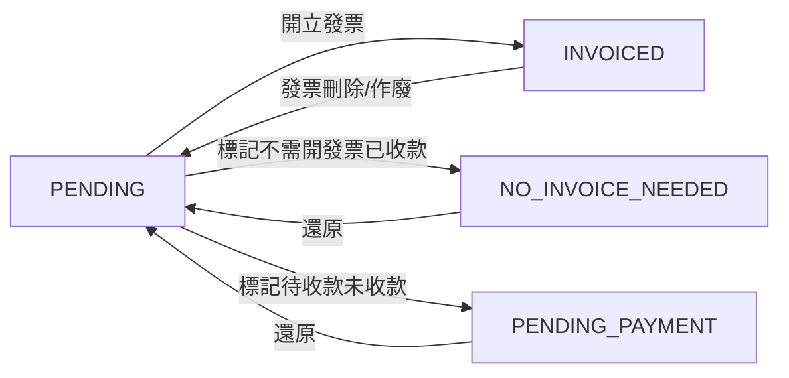

# 託運單管理功能說明

## 功能概述

託運單管理系統提供完整的託運單生命週期管理，包括新增、編輯、刪除、狀態管理、查詢篩選等功能。系統支援響應式設計，適配桌面、平板、手機等不同裝置。

---

## 一、託運單狀態管理

### 狀態定義

託運單採用 `WaybillStatus` 枚舉類型進行狀態管理，共有四種狀態：

| 狀態值              | 中文說明   | 英文說明          | 說明                                           |
| ------------------- | ---------- | ----------------- | ---------------------------------------------- |
| `PENDING`           | 待開發票   | Pending Invoice   | 尚未開立發票，可編輯、刪除、選取開立發票       |
| `INVOICED`          | 已開發票   | Invoiced          | 已開立發票，不可編輯、刪除，不可再被選入發票   |
| `NO_INVOICE_NEEDED` | 不需開發票 | No Invoice Needed | 不需開立發票且已收款，不可編輯、刪除           |
| `PENDING_PAYMENT`   | 待收款     | Pending Payment   | 不需開立發票但未收款，僅可編輯備註，不可全編輯 |

### 狀態轉換規則



#### 詳細轉換說明

1. **PENDING → INVOICED**

   - 觸發時機：開立發票成功時自動轉換
   - 後端處理：`InvoiceController.CreateInvoice`
   - 關聯操作：建立 `invoice_waybill` 關聯記錄

2. **PENDING → NO_INVOICE_NEEDED**

   - 觸發時機：使用者主動標記不需開發票且已收款
   - API 端點：`PUT /api/waybill/{id}/no-invoice`
   - 權限要求：`WaybillUpdate`
   - 支援批量操作：`PUT /api/waybill/no-invoice-batch`

3. **PENDING → PENDING_PAYMENT**

   - 觸發時機：使用者判斷無須開發票但未收款
   - API 端點：`PUT /api/waybill/{id}/pending-payment`
   - 權限要求：`WaybillUpdate`
   - 可選操作：同時更新備註

4. **INVOICED → PENDING**

   - 觸發時機：發票刪除或作廢時自動轉換
   - 後端處理：`InvoiceController.DeleteInvoice` / `VoidInvoice`
   - 關聯操作：刪除 `invoice_waybill` 關聯記錄，清除 `InvoiceId`

5. **NO_INVOICE_NEEDED → PENDING** / **PENDING_PAYMENT → PENDING**
   - 觸發時機：使用者主動還原
   - API 端點：`PUT /api/waybill/{id}/restore`
   - 權限要求：`WaybillUpdate`
   - 支援批量操作：`PUT /api/waybill/restore-batch`

### 狀態操作權限

| 狀態                | 可編輯 | 可刪除 | 可開發票 | 可標記不需開發票 | 可標記待收款 | 可編輯備註 | 可還原 |
| ------------------- | ------ | ------ | -------- | ---------------- | ------------ | ---------- | ------ |
| `PENDING`           | ✅     | ✅     | ✅       | ✅               | ✅           | ✅         | ❌     |
| `INVOICED`          | ❌     | ❌     | ❌       | ❌               | ❌           | ❌         | ❌     |
| `NO_INVOICE_NEEDED` | ❌     | ❌     | ❌       | ❌               | ❌           | ❌         | ✅     |
| `PENDING_PAYMENT`   | ❌     | ❌     | ❌       | ❌               | ❌           | ✅         | ✅     |

**註：** PENDING_PAYMENT 狀態僅可編輯備註，不可修改其他欄位。

---

## 二、託運單資料管理

### 表單欄位定義

| 欄位名稱              | 資料類型      | 必填 | 前端驗證         | 後端驗證           | 說明                   |
| --------------------- | ------------- | ---- | ---------------- | ------------------ | ---------------------- |
| id                    | UUID          | 是   | 自動產生         | UUID 格式          | 主鍵                   |
| waybillNumber         | string        | 否   | -                | -                  | 託運單號，可重複       |
| date                  | date (string) | 是   | 日期格式         | 日期格式           | 託運單日期             |
| item                  | string        | 是   | 必填             | 必填，最大 100 字  | 貨品名稱               |
| tonnage               | decimal       | 是   | 數值，大於 0     | 數值               | 噸數                   |
| companyId             | UUID          | 是   | 必須選擇         | 驗證公司存在且啟用 | 公司 ID                |
| companyName           | string        | 是   | 唯讀             | -                  | 公司名稱（唯讀顯示）   |
| loadingLocations      | array         | 是   | 至少一筆         | 至少一筆           | 裝卸地點列表           |
| workingTimeStart      | time (string) | 否   | 時間格式         | -                  | 用車開始時間           |
| workingTimeEnd        | time (string) | 否   | 時間格式         | -                  | 用車結束時間           |
| fee                   | decimal       | 是   | 數值，大於等於 0 | 數值               | 運費                   |
| driverId              | UUID          | 是   | 必須選擇         | 驗證司機存在且啟用 | 司機 ID                |
| driverName            | string        | 是   | 唯讀             | -                  | 司機名稱（唯讀顯示）   |
| plateNumber           | string        | 是   | 必填，最大 10 字 | 必填，最大 10 字   | 車牌號碼               |
| notes                 | string        | 否   | -                | -                  | 備註                   |
| extraExpenses         | array         | 否   | 金額大於等於 0   | 金額驗證           | 額外費用列表           |
| status                | enum (string) | 是   | 預設 PENDING     | 預設 PENDING       | 託運單狀態             |
| markAsNoInvoiceNeeded | boolean       | 否   | -                | -                  | 創建時標記為不需開發票 |

#### LoadingLocation 結構

```typescript
interface LoadingLocationDto {
  from: string; // 起點，必填
  to: string; // 終點，必填
}
```

#### ExtraExpense 結構

```typescript
interface ExtraExpenseDto {
  id?: string; // ID（編輯時）
  item: string; // 費用項目，必填
  fee: decimal; // 費用金額，必填
  notes?: string; // 備註
}
```

### CRUD 操作

#### 1. 新增託運單

- **API 端點**: `POST /api/waybill`
- **權限要求**: `WaybillCreate`
- **請求 Body**: `CreateWaybillDto`
- **特殊處理**:
  - 驗證 `companyId` 和 `driverId` 對應資料存在且啟用
  - 支援 `markAsNoInvoiceNeeded` 參數，創建時直接標記為不需開發票
  - 自動設定 `status` 為 `PENDING` 或 `NO_INVOICE_NEEDED`
  - 裝卸地點依序編號（`sequenceOrder`）
- **回傳**: `WaybillDto` + warnings（如有）

#### 2. 更新託運單

- **API 端點**: `PUT /api/waybill/{id}`
- **權限要求**: `WaybillUpdate`
- **請求 Body**: `UpdateWaybillDto`
- **前置驗證**:
  - 只有 `PENDING` 狀態可編輯
  - 其他狀態回傳 400 錯誤
- **特殊處理**:
  - 刪除舊的裝卸地點和額外費用
  - 新增更新後的裝卸地點和額外費用
  - 更新 `updatedAt` 時間戳
- **回傳**: `WaybillDto` + warnings（如有）

#### 3. 刪除託運單

- **API 端點**: `DELETE /api/waybill/{id}`
- **權限要求**: `WaybillDelete`
- **前置驗證**:
  - 只有 `PENDING` 狀態可刪除
  - 其他狀態回傳 400 錯誤
- **刪除範圍**:
  - 託運單主記錄
  - 關聯的裝卸地點（`LoadingLocation`）
  - 關聯的額外費用（`ExtraExpense`）
- **回傳**: 204 No Content

#### 4. 查詢託運單

##### 4.1 查詢託運單列表

- **API 端點**: `GET /api/waybill`
- **權限要求**: `WaybillRead`
- **查詢參數**:
  - `startDate`: 開始日期（可選）
  - `endDate`: 結束日期（可選）
  - `driverId`: 司機 ID（可選）
  - `locationSearch`: 地點搜尋關鍵字（可選，搜尋起訖點）
  - `companySearch`: 公司名稱搜尋關鍵字（可選）
- **排序**: 依 `date` 降序，`createdAt` 降序
- **回傳**: `WaybillDto[]`

##### 4.2 根據 ID 查詢單個託運單

- **API 端點**: `GET /api/waybill/{id}`
- **權限要求**: `WaybillRead`
- **回傳**: `WaybillDto`

##### 4.3 根據 IDs 批量查詢

- **API 端點**: `POST /api/waybill/by-ids`
- **權限要求**: `WaybillRead`
- **請求 Body**: `string[]` (waybillIds)
- **用途**: 發票編輯時查詢關聯的託運單
- **回傳**: `WaybillDto[]`

##### 4.4 查詢建議開票的託運單

- **API 端點**: `GET /api/waybill/suggested-for-invoice?companyId={id}`
- **權限要求**: `WaybillRead`
- **查詢條件**:
  - 指定公司的託運單
  - 狀態為 `PENDING`
  - 日期在一年內
- **排序**: 依 `date` 降序
- **用途**: 開立發票時顯示可選擇的託運單
- **回傳**: `WaybillDto[]`

### 狀態操作 API

#### 1. 標記為不需開發票

- **API 端點**: `PUT /api/waybill/{id}/no-invoice`
- **權限要求**: `WaybillUpdate`
- **前置驗證**: 狀態必須為 `PENDING` 或 `PENDING_PAYMENT`
- **狀態轉換**: → `NO_INVOICE_NEEDED`
- **回傳**: `{ message: "託運單已成功標記為不需開發票" }`

#### 2. 批量標記為不需開發票

- **API 端點**: `PUT /api/waybill/no-invoice-batch`
- **權限要求**: `WaybillUpdate`
- **請求 Body**: `string[]` (waybillIds)
- **處理邏輯**:
  - 逐筆驗證狀態
  - 成功/失敗分別記錄
  - 批量保存變更
- **回傳**:
  ```json
  {
    "message": "批量標記完成：成功 N 筆，失敗 M 筆",
    "summary": { "total": X, "success": N, "failure": M },
    "details": [ /* 每筆結果 */ ]
  }
  ```

#### 3. 標記為待收款

- **API 端點**: `PUT /api/waybill/{id}/pending-payment`
- **權限要求**: `WaybillUpdate`
- **請求 Body**: `UpdateNotesDto` (可選)
- **前置驗證**: 狀態必須為 `PENDING`
- **狀態轉換**: → `PENDING_PAYMENT`
- **可選操作**: 同時更新 `notes`
- **回傳**: `{ message: "託運單已成功標記為待收款狀態" }`

#### 4. 更新備註（僅 PENDING_PAYMENT 狀態）

- **API 端點**: `PUT /api/waybill/{id}/update-notes`
- **權限要求**: `WaybillUpdate`
- **請求 Body**: `UpdateNotesDto`
- **前置驗證**: 狀態必須為 `PENDING_PAYMENT`
- **可更新欄位**: 僅 `notes`
- **回傳**: `{ message: "託運單備註已成功更新" }`

#### 5. 還原為待開發票

- **API 端點**: `PUT /api/waybill/{id}/restore`
- **權限要求**: `WaybillUpdate`
- **前置驗證**: 狀態必須為 `NO_INVOICE_NEEDED` 或 `PENDING_PAYMENT`
- **狀態轉換**: → `PENDING`
- **回傳**: `{ message: "託運單已成功還原為待處理狀態" }`

#### 6. 批量還原

- **API 端點**: `PUT /api/waybill/restore-batch`
- **權限要求**: `WaybillUpdate`
- **請求 Body**: `string[]` (waybillIds)
- **處理邏輯**: 同批量標記
- **回傳**: 同批量標記格式

---

## 三、前端設計與實現

### 技術棧

- **框架**: React 18 + TypeScript
- **UI 組件**: Material-UI (MUI)
- **狀態管理**:
  - Recoil (客戶端狀態)
  - TanStack Query (伺服器狀態)
- **表單管理**: React Hook Form
- **資料表格**: AG Grid (支援虛擬滾動)
- **日期處理**: date-fns
- **路由**: React Router DOM
- **建構工具**: Vite

### 響應式設計

#### 1. 桌面版 (≥1200px)

- **佈局**: 左右分欄
  - 左側：託運單列表（AG Grid）
  - 右側：託運單表單（固定寬度 550px）
- **操作方式**:
  - 點擊列表項目直接在右側編輯
  - 新增按鈕位於右上角

#### 2. 平板版 (768px - 1199px)

- **佈局**: 同桌面版
- **調整**: 按鈕尺寸較小

#### 3. 手機版 (<768px)

- **佈局**: 單欄佈局
  - 列表顯示為卡片式
  - 表單以 Drawer 形式彈出（佔屏幕 90% 高度）
- **操作方式**:
  - 點擊卡片開啟 Drawer 編輯
  - 新增按鈕位於頁面頂部

### 主要功能組件

#### 1. WaybillPage 主頁面

- **路徑**: `src/features/Waybill/components/WaybillPage/WaybillPage.tsx`
- **功能**:
  - 月份選擇器（MonthPicker）
  - 司機快速篩選按鈕
  - 地點搜尋（debounce 500ms）
  - 公司搜尋（debounce 500ms）
  - 響應式佈局切換
  - 新增/編輯/刪除確認對話框

#### 2. WaybillGrid 列表組件

- **路徑**: `src/features/Waybill/components/WaybillGrid/WaybillGrid.tsx`
- **功能**:
  - 桌面版：AG Grid 表格（支援排序、分組）
  - 手機版：卡片式列表
  - 狀態 Chip 顯示（顏色區分）
  - 操作按鈕（依狀態動態顯示）

#### 3. WaybillForm 表單組件

- **路徑**: `src/features/Waybill/components/WaybillForm/WaybillForm.tsx`
- **功能**:
  - 完整表單驗證
  - 公司/司機即時新增
  - 裝卸地點動態增減
  - 額外費用動態增減
  - Readonly 模式（非 PENDING 狀態）

#### 4. useWaybillTable Hook

- **路徑**: `src/features/Waybill/hooks/useWaybillTable.tsx`
- **功能**:
  - AG Grid 欄位定義
  - 狀態 Chip 渲染
  - 操作按鈕渲染（依狀態）
  - 分組、排序、篩選設定

### 狀態視覺化設計

| 狀態                | Chip 顏色 | Chip 文字  | 可用操作       |
| ------------------- | --------- | ---------- | -------------- |
| `PENDING`           | warning   | 待開發票   | 編輯、刪除     |
| `INVOICED`          | success   | 已開發票   | 查看           |
| `NO_INVOICE_NEEDED` | default   | 不需開發票 | 查看           |
| `PENDING_PAYMENT`   | error     | 待收款     | 查看、編輯備註 |

### 查詢與篩選功能

1. **月份選擇器**:

   - 使用 date-fns 的 `startOfMonth` / `endOfMonth`
   - 預設當月

2. **司機篩選**:

   - 快速按鈕切換
   - 「全部」選項

3. **地點搜尋**:

   - Debounce 500ms
   - 搜尋 `from` 和 `to` 欄位
   - 後端模糊匹配

4. **公司搜尋**:
   - Debounce 500ms
   - 搜尋公司名稱
   - 後端模糊匹配

---

## 四、資料庫設計

### Table: waybill

| 欄位名稱           | 型別          | PK  | Not Null | Default   | 說明                                                       |
| ------------------ | ------------- | --- | -------- | --------- | ---------------------------------------------------------- |
| id                 | UUID          | Y   | Y        | gen_uuid  | 主鍵                                                       |
| waybill_number     | VARCHAR(50)   | N   | N        | NULL      | 託運單號（可重複，可為空）                                 |
| date               | VARCHAR       | N   | Y        | -         | 日期（字串格式 yyyy-MM-dd）                                |
| item               | VARCHAR(100)  | N   | Y        | -         | 貨品名稱                                                   |
| company_id         | UUID          | N   | Y        | -         | 公司 ID（FK: company）                                     |
| working_time_start | VARCHAR       | N   | N        | NULL      | 用車開始時間（字串格式）                                   |
| working_time_end   | VARCHAR       | N   | N        | NULL      | 用車結束時間（字串格式）                                   |
| tonnage            | DECIMAL(18,2) | N   | Y        | -         | 噸數                                                       |
| fee                | DECIMAL(18,2) | N   | Y        | -         | 運費                                                       |
| driver_id          | UUID          | N   | Y        | -         | 司機 ID（FK: driver）                                      |
| plate_number       | VARCHAR(10)   | N   | Y        | -         | 車牌號碼                                                   |
| notes              | TEXT          | N   | N        | NULL      | 備註                                                       |
| status             | VARCHAR(20)   | N   | Y        | 'PENDING' | 狀態（PENDING/INVOICED/NO_INVOICE_NEEDED/PENDING_PAYMENT） |
| invoice_id         | UUID          | N   | N        | NULL      | 發票 ID（FK: invoice，INVOICED 狀態時有值）                |
| created_at         | VARCHAR       | N   | Y        | UTC now   | 建立時間（字串格式 ISO 8601）                              |
| updated_at         | VARCHAR       | N   | Y        | UTC now   | 更新時間（字串格式 ISO 8601）                              |

### Table: loading_location

| 欄位名稱       | 型別    | PK  | Not Null | Default  | 說明             |
| -------------- | ------- | --- | -------- | -------- | ---------------- |
| id             | UUID    | Y   | Y        | gen_uuid | 主鍵             |
| waybill_id     | UUID    | N   | Y        | -        | FK: waybill      |
| from_location  | VARCHAR | N   | Y        | -        | 起點             |
| to_location    | VARCHAR | N   | Y        | -        | 終點             |
| sequence_order | INT     | N   | Y        | -        | 順序（用於排序） |

### Table: extra_expense

| 欄位名稱    | 型別          | PK  | Not Null | Default  | 說明               |
| ----------- | ------------- | --- | -------- | -------- | ------------------ |
| id          | UUID          | Y   | Y        | gen_uuid | 主鍵               |
| waybill_id  | UUID          | N   | Y        | -        | FK: waybill        |
| description | VARCHAR       | N   | N        | NULL     | 描述（舊欄位）     |
| amount      | DECIMAL(18,2) | N   | N        | NULL     | 金額（舊欄位）     |
| item        | VARCHAR       | N   | N        | NULL     | 費用項目（新欄位） |
| fee         | DECIMAL(18,2) | N   | N        | NULL     | 費用（新欄位）     |
| notes       | TEXT          | N   | N        | NULL     | 備註               |

**註**: `item`/`fee` 和 `description`/`amount` 為相同用途的新舊欄位，程式碼中會優先使用新欄位。

---

## 五、業務規則與限制

### 1. 狀態操作限制

- **編輯**:

  - ✅ PENDING: 可編輯所有欄位
  - ❌ INVOICED: 完全不可編輯（已有發票）
  - ❌ NO_INVOICE_NEEDED: 完全不可編輯（已標記不需開票）
  - ⚠️ PENDING_PAYMENT: 僅可編輯 `notes` 欄位

- **刪除**:

  - ✅ PENDING: 可刪除
  - ❌ 其他狀態: 不可刪除

- **開立發票**:
  - ✅ PENDING: 可選入發票
  - ❌ 其他狀態: 不可選入發票

### 2. 資料驗證規則

- **公司/司機驗證**:

  - 必須選擇已存在的公司/司機
  - 公司/司機必須為啟用狀態（`IsActive = true`）

- **日期驗證**:

  - 格式: `yyyy-MM-dd`
  - 後端不限制日期範圍

- **金額驗證**:

  - `fee` 和 `tonnage` 必須 ≥ 0
  - `extraExpenses.fee` 必須 ≥ 0

- **託運單號**:
  - **不檢查唯一性**，可重複
  - 可為空值

### 3. 批量操作規則

- **批量標記/還原**:
  - 逐筆驗證狀態
  - 部分成功時不回滾
  - 返回詳細的成功/失敗清單
  - 提示總結資訊

### 4. 權限控制

所有 API 需要對應權限：

- `WaybillRead`: 查詢託運單
- `WaybillCreate`: 新增託運單
- `WaybillUpdate`: 更新託運單、狀態操作
- `WaybillDelete`: 刪除託運單

---

## 六、與發票管理的整合

### 1. 狀態同步

- **開立發票時**:

  - 託運單狀態 → `INVOICED`
  - 設定 `invoiceId`
  - 建立 `invoice_waybill` 關聯

- **刪除/作廢發票時**:
  - 託運單狀態 → `PENDING`
  - 清除 `invoiceId`
  - 刪除 `invoice_waybill` 關聯

### 2. 額外費用處理

- 託運單的額外費用可在開立發票時選擇性加入
- 透過 `invoice_extra_expense` 表關聯
- 額外費用是否含稅影響發票稅額計算

---

## 七、錯誤處理

### 常見錯誤碼與訊息

| HTTP 狀態碼 | 錯誤情境             | 錯誤訊息範例                                         |
| ----------- | -------------------- | ---------------------------------------------------- |
| 400         | 狀態不符無法編輯     | 無法編輯狀態為 'INVOICED' 的託運單                   |
| 400         | 狀態不符無法刪除     | 只有 'PENDING' 狀態的託運單可以刪除                  |
| 400         | 公司 ID 無效或已停用 | 無效的公司 ID 或公司已停用                           |
| 400         | 司機 ID 無效或已停用 | 無效的司機 ID 或司機已停用                           |
| 400         | 狀態不符無法標記     | 只有 'PENDING' 狀態的託運單可以標記為不需開發票      |
| 400         | 狀態不符無法還原     | 只有 'NO_INVOICE_NEEDED' 或 'PENDING_PAYMENT' 可還原 |
| 404         | 託運單不存在         | 找不到指定的託運單                                   |

---

## 八、未來優化方向

1. **分組顯示功能** (規劃中):

   - 依司機、公司、日期分組
   - 分組統計（數量、總金額）
   - 展開/收合功能

2. **批量編輯功能**:

   - 批量修改司機
   - 批量修改公司

3. **匯出功能**:

   - Excel 匯出
   - PDF 報表

4. **進階搜尋**:
   - 複合條件搜尋
   - 保存搜尋條件

---

> 本規格文件根據實際程式碼反向工程產生，最後更新：2025-01-11
> 如有異動，請同步更新前後端實作與本文件。
